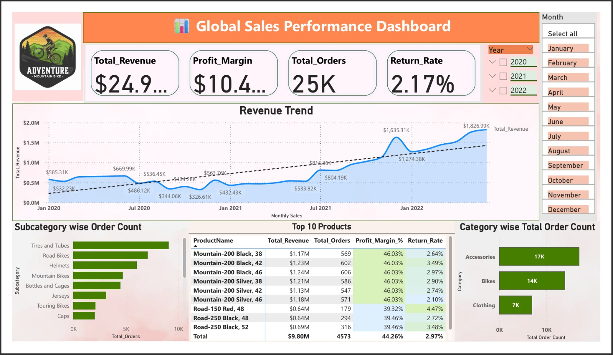

# 📊 Dashlytics-Sales-Intelligence-Dashboard | Power BI Project
Uncovering trends, performance, and insights across global sales

An end-to-end **Power BI dashboard project** built using the popular Adventure Works dataset to explore sales trends, optimize decision-making, and present clear business insights. This project showcases my capabilities in **data cleaning, transformation, modeling, and visualization** using Power BI.

) <!-- Replace with actual screenshot -->

---

## 🚀 Project Overview

This project simulates a real-world business scenario where a company needs to monitor its sales performance across different regions, product lines, and time periods. I’ve designed an interactive dashboard with dynamic visuals, performance KPIs, and data-driven storytelling.

---

## 🧹 Data Preparation Highlights

- ✅ **Cleaned and transformed raw tables** using **Power Query Editor** (M Language).
- 🧮 **Added custom columns** (e.g., `Profit`, `Year`, `Month Name`, `Sales Category`) to enhance analytical depth.
- 🔄 Handled **nulls, inconsistent formats, and duplicates** across key tables (Sales, Products, Geography, Calendar).
- 🔗 Built proper **data model with relationships** for accurate filtering and slicing.
- 📊 Created multiple **DAX measures** to calculate totals, averages, YoY growth, and margins.

---

## 📌 Key Features

- **📈 Sales Trends Dashboard**: Monthly/Quarterly performance, Year-over-Year comparisons.
- **🌎 Regional Analysis**: Sales contribution by region, country, and city.
- **🛍️ Product Insights**: Top-selling categories, sub-categories, and SKUs.
- **📊 KPI Cards**: Revenue, Profit, Quantity Sold, and Profit Margin – all dynamically updating.
- **🧭 Slicer Navigation**: Easy filtering by Year, Country, Product Category, Sales Channel, etc.
- **📅 Time Intelligence**: Used DAX for advanced date-based measures and comparison analysis.

---

## 🧰 Tools & Technologies

- **Power BI Desktop**
- **Power Query Editor (ETL)**
- **DAX (Data Analysis Expressions)**
- **Data Modeling**
- **Adventure Works Dataset**

---

## 📷 Dashboard Preview

((Dashboard.jpg))

---

