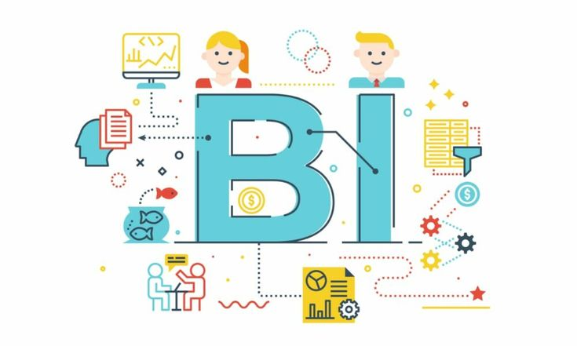

# 📊 Dashlytics-Sales-Intelligence-Dashboard | Power BI Project
Uncovering trends, performance, and insights across global sales

An end-to-end **Power BI dashboard project** built using the popular Adventure Works dataset to explore sales trends, optimize decision-making, and present clear business insights. This project showcases my capabilities in **data cleaning, transformation, modeling, and visualization** using Power BI.

 <!-- Replace with actual screenshot -->

---

## 🚀 Project Overview

This project simulates a real-world business scenario where a company needs to monitor its sales performance across different regions, product lines, and time periods. I’ve designed an interactive dashboard with dynamic visuals, performance KPIs, and data-driven storytelling.

🚀 What This Project Is About
Imagine a global company that wants to track sales trends and improve strategy. This dashboard helps answer:

What are our top-selling products?

Which regions are driving profit?

How do our numbers change month over month or year over year?

---

## 🧹 Data Preparation Highlights

- ✅ Cleaned messy tables using Power Query.
- 🧮 Created helpful fields like Profit, Sales Category, and Month Name.
- 🔄 Removed duplicates and handled missing data.
- 🔗 Built relationships between tables to allow smooth filtering and slicing.
- 📊 Created multiple **DAX measures** to calculate totals, averages, YoY growth, and margins.

---

## 📌 Key Features

- **📈 Sales Trends Dashboard**: Monthly/Quarterly performance, Year-over-Year comparisons.
- **🌎 Regional Analysis**: Sales contribution by region, country, and city.
- **🛍️ Product Insights**: Top-selling categories, sub-categories, and SKUs.
- **📊 KPI Cards**: Revenue, Profit, Quantity Sold, and Profit Margin – all dynamically updating.
- **🧭 Slicer Navigation**: Easy filtering by Year, Country, Product Category, Sales Channel, etc.
- **📅 Time Intelligence**: Used DAX for advanced date-based measures and comparison analysis.

---

## 🧰 Tools & Technologies

- **Power BI Desktop**
- **Power Query Editor (ETL)**
- **DAX (Data Analysis Expressions)**
- **Data Modeling**
- **Adventure Works Dataset**

---

## 📷 Dashboard Preview

---

